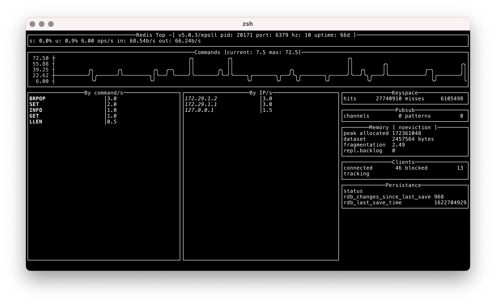

Redis Top
=========

Redistop uses [MONITOR](https://valkey.io/commands/monitor/) to watch Valkey
commands and shows per command and per host statistics.

> Because MONITOR streams back all commands, its use comes at a cost.

Redistop uses [INFO](https://valkey.io/commands/info/) command too.

"Redis stop" means "Say stop again" in french, and it's hard to find a new joke with Valkey.

Example
-------

Build
-----

If you have recent golang dev enironment set, you can build it with the Makefile

    make

If you need a Linux compilation, or juste using Docker:

    make docker-build

License
-------

GPL v3
